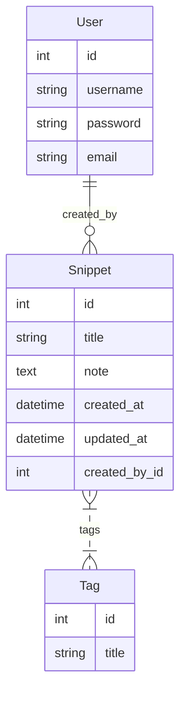

# snipbox

SnipBox is a short note saving app which lets you save short notes and group them together with tags.

## API Endpoints

The following endpoints are available:

- `GET /api/snippets/`: Retrieve a list of all snippets.
- `POST /api/snippets/create/`: Create a new snippet.
- `GET /api/snippets/<id>/`: Retrieve a specific snippet.
- `PUT /api/snippets/<id>/update/`: Update a specific snippet.
- `DELETE /api/snippets/<id>/delete/`: Delete a specific snippet.
- `GET /api/tags/`: Retrieve a list of all tags.
- `GET /api/tags/<id>/`: Retrieve a specific tag and all associated snippets.

## Database Schema

The following diagram illustrates the database schema:



## Setup and Installation

1. **Clone the repository:**

   ```bash
   # Using HTTPS
   git clone https://github.com/bshivaganesh-personal/snipbox.git
   
   # Using SSH
   git clone git@github.com:bshivaganesh-personal/snipbox.git
   ```

2. **Navigate to the project directory:**

   ```bash
   cd snipbox
   ```

3. **Create and activate a virtual environment:**

   ```bash
   # For Linux/macOS
   python3 -m venv .venv
   source .venv/bin/activate

   # For Windows
   python -m venv .venv
   .venv\Scripts\activate
   ```

4. **Install dependencies:**

   ```bash
   pip install -r requirements.txt
   ```

5. **Run database migrations:**

   ```bash
   python manage.py migrate
   ```

6. **Run the development server:**

   ```bash
   python manage.py runserver
   ```

## Testing with cURL

Once the development server is running, you can use `curl` to test the API endpoints. First, you need to obtain a JWT token for authentication.

1. **Create a user:**

   You can create a superuser to test the API:

   ```bash
   python manage.py createsuperuser
   ```

2. **Get a JWT token:**

   Replace `your-username` and `your-password` with the credentials you just created.

   ```bash
   curl -X POST -H "Content-Type: application/json" -d '{"username": "your-username", "password": "your-password"}' http://127.0.0.1:8000/api/auth/token/
   ```

   You will receive an access and refresh token. Copy the access token for the next requests.

3. **Get all snippets:**

   Replace `your-access-token` with the token you received.

   ```bash
   curl -X GET -H "Authorization: Bearer your-access-token" http://127.0.0.1:8000/api/snippets/
   ```

4. **Create a snippet:**

   ```bash
   curl -X POST -H "Content-Type: application/json" -H "Authorization: Bearer your-access-token" -d '{"title": "My First Snippet", "note": "This is a test snippet.", "tags": [{"title": "test"}]}' http://127.0.0.1:8000/api/snippets/create/
   ```

## Dependencies

- asgiref==3.7.2
- autopep8==2.3.2
- Django==5.0.13
- djangorestframework==3.14.0
- djangorestframework-simplejwt==5.3.0
- pycodestyle==2.14.0
- PyJWT==2.8.0
- pytz==2025.2
- sqlparse==0.4.4
- typing_extensions==4.9.0
